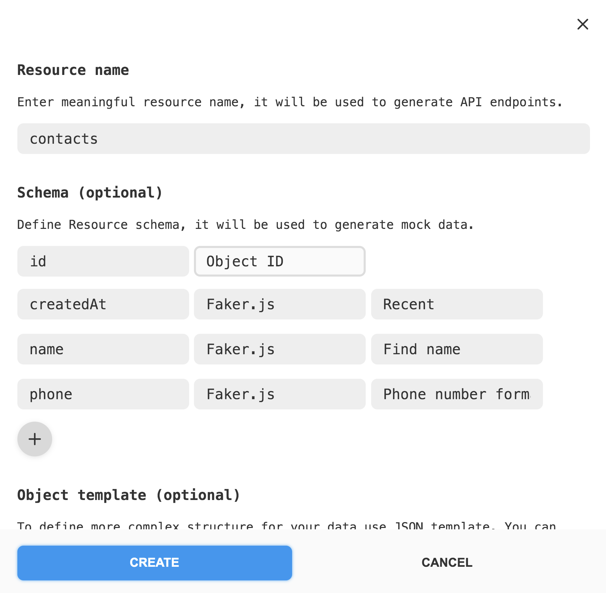

## Asynchronous Redux. Selectors and Reselect library.

### Task - Admission criteria

Use this
[React project template](https://github.com/goitacademy/react-homework-template/blob/main/README.en.md)
as a starting point for your application.

- Created repository `react-hw-07-phonebook`.
- Used the library `Redux Toolkit`.

### Contact book

Perform refactoring of the Contact Book application code. Remove the code
responsible for storing and reading contacts from the local storage, and add
communication with the backend for storing contacts.

### Backend

Create your own personal backend for development with the UI service
[mockapi.io](https://mockapi.io/). Sign up using your GitHub account. Create a
resource `contacts` to get your handpoint `/contacts`. Use resource constructor
and describe the contact object as on the picture.

Contact schema 

### State Form

Add the load and error indicator handling to the Redux state. To do this, change
the state form.

```javascript
{
   contacts: {
      items: [],
      isLoading: false,
      error: null
      },
   filter: ""
}
```

### Operations

Use [createAsyncThunk](https://redux-toolkit.js.org/api/createAsyncThunk) to
declare asynchronous action generators and make HTTP requests. Do the processing
of the actions and change data in Redux state with
[createSlice](https://redux-toolkit.js.org/api/createSlice).

Declare the following operations:

- `fetchContacts` - get an array of contacts (GET method) by GET request. The
  basic type of action `"contacts/fetchAll"`.
- `addContact` - add contact (POST method). Basic type of action
  `"contacts/addContact"`.
- `deleteContact` - deletes a contact (DELETE method). Basic type of action
  `"contacts/deleteContact"`.
